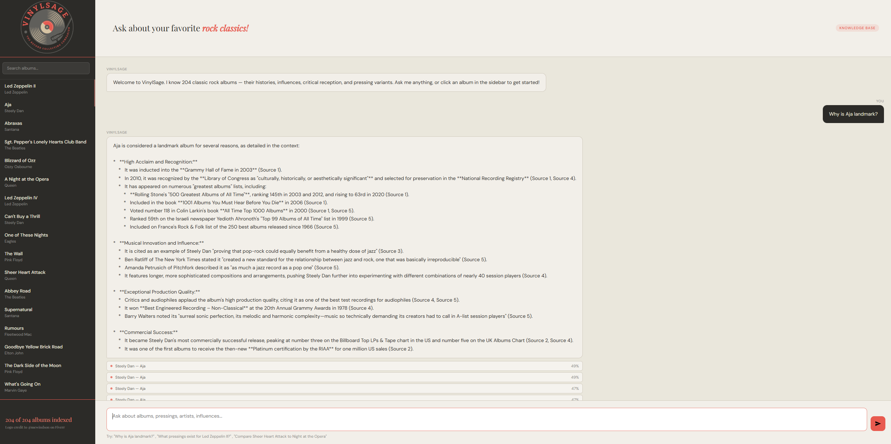
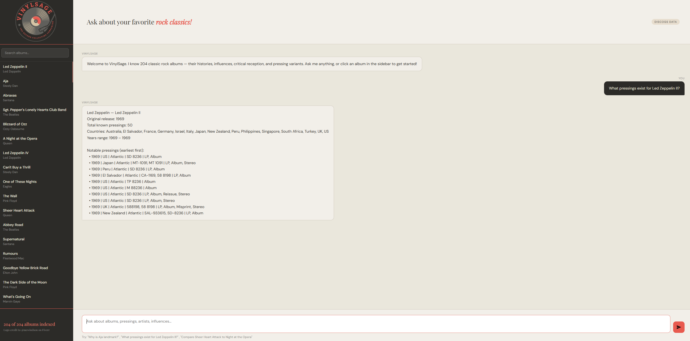

# VINYL SAGE
### The Classic Rock Collector's Companion

My project **VinylSage** is an exciting bridge between two of my personal interests:
1. Customization with large language models
2. Classic Rock record collecting

## Check it out:
[vinylsage](vinyl-sage.vercel.app) 

VinylSage offers specialized information and advice on the 204 albums it is trained on.
- General information based searches query the Gemini LLM to search the index of data chunks and return a multitude of related info from Album/song history to unique recording techniques. 
  
- Targeted collector info such as 'Pressings' and 'Variants' trigger the routing to call the Discogs API.

- The sidebar allows you to both search for included albums, and click to pre-load an example question to VinylSage.

## Wikipedia + LLM pipeline:

## Discogs pipeline:

Credit to @mewindson on fiverr for the logo design
